Hey there, I'm Amith Maximus 👋
Java Backend Developer | Spring Boot | AI-Integrated Backend

    

    

👨‍💻 About Me
I am a Computer Science student focused on Java backend development, Spring Boot, REST APIs, SQL/MySQL, and AI integration.

I enjoy building backend systems, working with databases and APIs, automating repetitive tasks with Python, and learning how Generative AI can be integrated into software applications.

<table> <tr> <td width="50%" valign="top">

🎓 Education
B.Tech CSE — VVIT
July 2025 – May 2028
CGPA: 8.0/10

Diploma in Computer Engineering
Maddi Bala Tripura Sundaram Government Polytechnic
2022 – 2025
Percentage: 81%

</td>

<td width="50%" valign="top">

🎯 Open To
Java Backend Internships

Spring Boot Internships

Software Engineering Internships

AI-integrated Backend Projects

Opportunities in India and Germany

</td> </tr> </table>

🛠️ Tech Stack
<table> <tr> <td width="25%"><b>Programming</b></td> <td>Java · Python · SQL</td> </tr>

<tr> <td><b>Backend</b></td> <td>Spring Boot · REST APIs · JPA · Hibernate · Spring Security · JWT</td> </tr>

<tr> <td><b>Databases</b></td> <td>MySQL · PostgreSQL</td> </tr>

<tr> <td><b>Automation & Data</b></td> <td>Python Automation · Web Scraping · Excel · CSV Data Processing</td> </tr>

<tr> <td><b>AI & Tools</b></td> <td>Generative AI · Prompt Engineering · AI Tools · Git · GitHub</td> </tr>

<tr> <td><b>Cloud & DevOps</b></td> <td>Docker · AWS</td> </tr> </table>

🤖 AI Integration & Generative AI
<table> <tr> <td width="45%"><b>Area</b></td> <td width="55%"><b>Current Level</b></td> </tr>

<tr> <td>Generative AI</td> <td>Working Knowledge</td> </tr>

<tr> <td>Prompt Engineering</td> <td>Working Knowledge</td> </tr>

<tr> <td>AI Tools</td> <td>Practical</td> </tr>

<tr> <td>AI Integration</td> <td>Learning</td> </tr>

<tr> <td>Spring AI</td> <td>Learning</td> </tr>

<tr> <td>LLM Applications</td> <td>Learning</td> </tr> </table>

I am focusing on using Generative AI and AI tools in development workflows and learning how to build LLM-powered applications with Java and Spring.

🚀 Featured Project
Student Management System
A backend application for managing student records using Java and Spring Boot, with REST APIs for CRUD operations and MySQL for persistent data storage.

<table> <tr> <td width="30%"><b>Area</b></td> <td width="70%"><b>Details</b></td> </tr>

<tr> <td><b>Stack</b></td> <td>Java · Spring Boot · REST APIs · MySQL</td> </tr>

<tr> <td><b>Purpose</b></td> <td>Student record management</td> </tr>

<tr> <td><b>Core</b></td> <td>REST CRUD APIs</td> </tr>

<tr> <td><b>Database</b></td> <td>MySQL</td> </tr>

<tr> <td><b>Focus</b></td> <td>Backend development and API design</td> </tr>

<tr> <td><b>Repository</b></td> <td> <a href="https://github.com/Maxymus27/cognevance_studentManagementSystem"> View on GitHub </a> </td> </tr> </table>

What I Built
Built the backend using Spring Boot

Created REST APIs for CRUD operations

Integrated MySQL for persistent data storage

💼 Experience
Python Automation Intern — BidAlert
November 20, 2024 – May 10, 2025

<table> <tr> <td width="30%"><b>Area</b></td> <td width="70%"><b>Work</b></td> </tr>

<tr> <td><b>Automation</b></td> <td>Built Python automation tools for repetitive workflows.</td> </tr>

<tr> <td><b>Web Scraping</b></td> <td>Collected tender information from international and Indian websites.</td> </tr>

<tr> <td><b>Data Processing</b></td> <td>Processed and maintained tender data using Excel and CSV files.</td> </tr>

<tr> <td><b>AI Tools</b></td> <td>Used AI tools to support development and content-related workflows.</td> </tr>

<tr> <td><b>Publishing</b></td> <td>Worked with tender tracking, documentation, email marketing, and content publishing.</td> </tr>

<tr> <td><b>Team</b></td> <td>Coordinated tasks with a team of 12 interns.</td> </tr> </table>

🏆 Achievements
<table> <tr>

<td width="33%" align="center">

4★
CodeChef

</td>

<td width="33%" align="center">

200 Days
Coding Streak

</td>

<td width="33%" align="center">

1000+
Competitive Programming Difficulty

</td>

</tr> </table>

📜 Certifications
<table> <tr> <td width="35%"><b>Certification</b></td> <td width="65%"><b>Details</b></td> </tr>

<tr> <td>Generative AI — Google Cloud</td> <td>L4G · 45-hour course · 22 skill badges</td> </tr>

<tr> <td>Learn Java Programming — CodeChef</td> <td>2026</td> </tr>

<tr> <td>Python Programming — Microsoft / Skill India</td> <td>40-hour course</td> </tr>

<tr> <td>Prompt Engineering — Infosys Springboard</td> <td>2026</td> </tr> </table>

📊 GitHub Analytics

<table> <tr>

<td width="50%" align="center">

</td>

<td width="50%" align="center">

</td>

</tr> </table>

 

📈 Contribution Activity

🐍 Contribution Snake

<picture>

<source media="(prefers-color-scheme: dark)" srcset="https://raw.githubusercontent.com/Maxymus27/Maxymus27/gh-pages/github-snake-dark.svg">

<source media="(prefers-color-scheme: light)" srcset="https://raw.githubusercontent.com/Maxymus27/Maxymus27/gh-pages/github-snake.svg">

</picture>

🎯 Current Focus
Learning
Java & DSA

Spring Boot & REST APIs

SQL & MySQL

JPA / Hibernate

Spring Security / JWT

Docker & AWS

Spring AI

LLM APIs, RAG & AI Agents

System Design

Building
Java backend applications

REST API based systems

Database-driven applications

AI-integrated backend applications

Open To
Java Backend / Spring Boot Internships

Software Engineering Internships

AI-integrated Backend Projects

Opportunities in India and Germany

🤝 Connect With Me

 

Build. Learn. Ship. Repeat.

